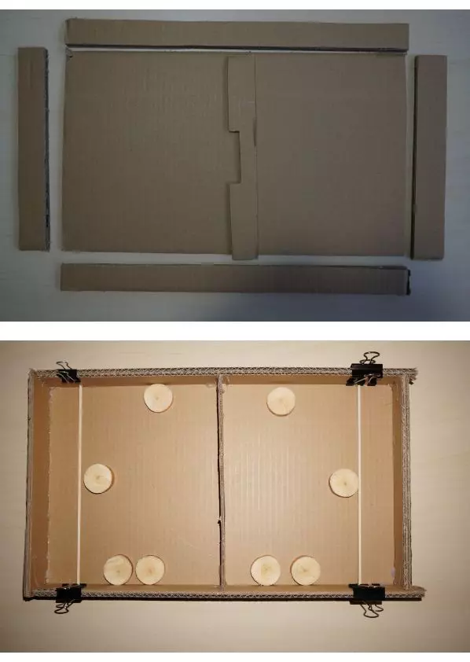

# bricolages

Section of different creations builds

* [Phone support for tripod](./support_telephone/README.md)

* [Raspberry Pi sensors (AM2301, DHT11, DS18B20)](https://github.com/jingl3s/raspberry_pi_sensors)

* [Raspberry Pi et AM2301](https://github.com/jingl3s/raspberry_pi_DHT21-AM2301/blob/master/README.md)

* Jeu hockey carton  
  

* Réparation Tablette Samsung Note 8 GT-N5110
  * Procedure suivi
    * Utilisation de différents cables
    * Utilisation de chargeurs Samsung et autre avec 500mA de charge
    * Ouverture
    * Tests de continuité électrique entre batterie et carte
    * Test entre connecteur USB et alentour de la charge
    * Après plusieurs démontage du connecteur de la batterie, observation que la partie positive est dessoudé
    * Souder avec le fer les petites pates du connecteur

  * Liens utilisés
    * [Astuce de base pour la suite de l'analyse](https://www.techrepublic.com/article/pro-tip-revive-your-samsung-galaxy-tab-when-the-battery-has-completely-drained/)
    * [Investigation panne charge tablette android](https://www.youtube.com/watch?v=fja8Uehju-U)
    * Port USB défaillant
      * [Samsung Tab Note 8 investigation anomalie port USB](https://www.youtube.com/watch?v=nDFG7y2jfUo)
      * [Remplacement du port USB](https://www.youtube.com/watch?v=wN6lYShAfdc)
      * [Autre remplacement](https://www.youtube.com/watch?v=nvpNliFIuN4)
    * [Démontage de batterie utile pour aider a la recherche](https://www.youtube.com/watch?v=Fl6r9Fb873M)
    * [Astuce en déconnectant tout](https://www.youtube.com/watch?v=G0eZJ9IeWr0)

* USB réveil équipement https://askubuntu.com/questions/848698/wake-up-from-suspend-using-wireless-usb-keyboard-or-mouse-for-any-linux-distro
* Investigation imprimante Brother
  * Astuces
    * Ne pas utiliser un tournevis pour essayer de déboucher le départ des impressions: Risque de perçage du tuyau
    * Utiliser un quitte seringue de Aliexpress pour y mettre de l'eau chaude et un chiffon sous la tète de sortie
    * Instruction démontage : https://fr.ifixit.com/Tutoriel/MFC-J4410DW+Flushing+Box+Replacement/125058?lang=en
    * Menus caché Brother : https://www.youtube.com/watch?v=P-pXJTtlkFM
    * Comment sen sortir https://www.inkmagic.com/shopcontent.asp?type=Unclog_Brother_Inkjet_Printhead_Nozzles

## Outils

* Dévisser un vis avec tête triangle
  * Utiliser un tournevis Torx ou un tournevis plat
  * Sources :
    * https://www.youtube.com/watch?v=p1rejpiSTP4
    * https://www.youtube.com/watch?v=QGWdCF8M5tg

## Peinture

* Décaper du verni
  * Essai avec bicarbonate de soude.
    * Résultat : Le verni est passé un peu mat sans plus
    * Source : https://www.youtube.com/watch?v=RoUqkWkLdz0
  * Solution : Poncer avec du papier de verre est le plus efficace