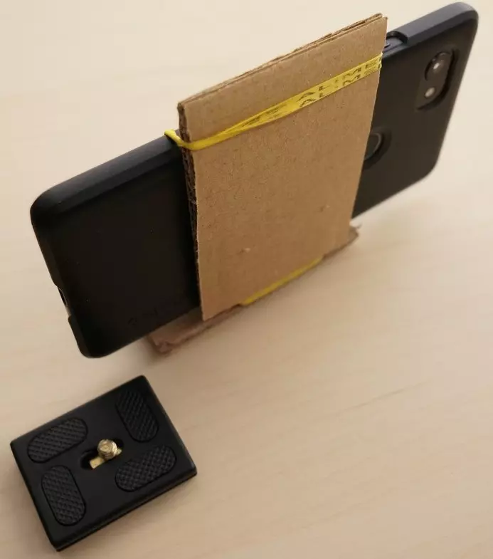

# Phone support for tripod

Create a basic phone support to hold the phone to take some picture with a tripod.
Take a look at the photos

## Materials

* Cardboard
* Metal 90° plate
* Rubber

## Images

