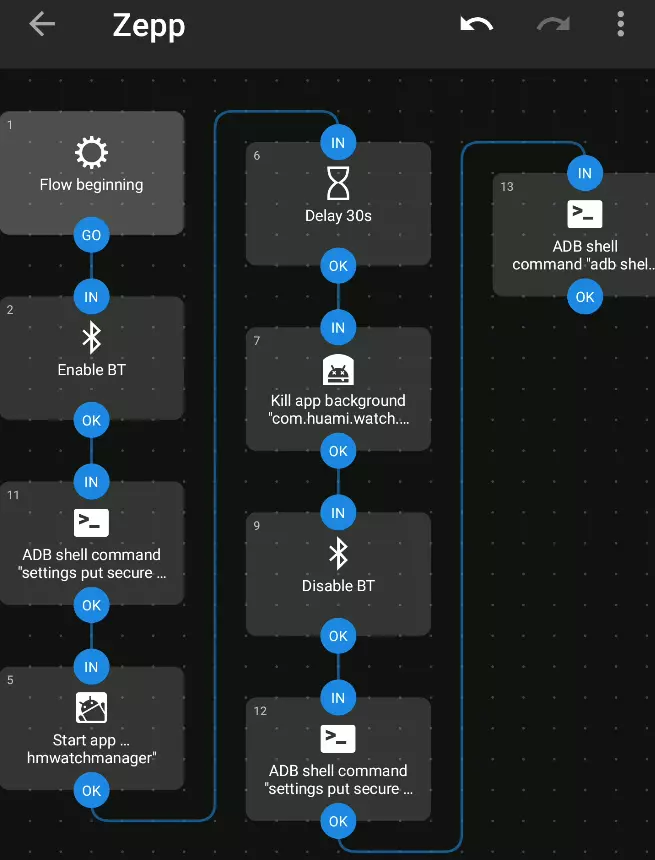

# Android AmazFit Band 5 automatisation sync

## Objectif

* Avoir le telephone Android en mode bluetooth désactivé tout le temps
* Avoir un racourci pour activier les connectivité, lancer le logiciel pour sync avec Amazfit et fermer l'application

## Pré requis

* Android >= 9
* [Automate](https://llamalab.com/automate) installé
* Zepp installé est configuré avec Amazfit Band 5
* Android en mode développeur avec USB debug activé
* Ordinateur avec ADB installé et configuré  avec l'appareil Android

## Mise en oeuvre

* Autoriser Automate de changer l'état de la localisation

```shell
adb shell pm grant com.llamalab.automate android.permission.ACCESS_COARSE_LOCATION
```

* Changer l'état du debug USB sur port réseau pour être utilisé depuis Automate
  * A refaire si appareil Android est redémarré

```shell
adb tcpip 5555
```

* Test si les commandes ADB vont fonctionner

  * Lance le programme
    
    `adb shell am start -n com.huami.watch.hmwatchmanager/com.xiaomi.hm.health.activity.StartUpActivity`

  * Arrêt du programme

    `adb shell am force-stop com.huami.watch.hmwatchmanager`

  * Active le positionnement GPS nécessaire au bluetooth BLE
    
    `adb shell settings put secure location_mode 3`

  * Désactive le positionnement GPS
    
    `adb shell settings put secure location_mode 0`

* Ouvrir Automate pour configurer l'automatisation
* Ajouter une nouvelle automatisation
* Créer un flux comme celui-ci
  * Activer Bluetooth
  * ADB shell command
    * Si premiere fois il faut clicker sur install generated key + en sélectionner une dans Keychain Alias
    * Commande ajouté
      
      `adb shell settings put secure location_mode 3`

  * Démarrage Application Zepp
  * Délai de 30 secondes pour laisser le temps de synchronisation
  * Arrêt tache de fon avec Kill app background Zepp
  * Désactive le Bluetooth
  * ADB shell command
    `adb shell settings put secure location_mode 0`
  * ADB shell command
    * Cette commande ne fonctionne pas depuis Automate mais fonctionne depuis console
    `adb shell am force-stop com.huami.watch.hmwatchmanager`
    

* Maintenant un petit widget et le raccourcis (Widget) est pret pour faciliter la sync

## Sources

* Adb information depuis Automate (activer des permissions supplémentaires) https://llamalab.com/automate/doc/adb.html
* Propriété Android pour la permission https://developers.google.com/android/reference/com/google/android/gms/location/LocationRequest
* Activation de la position GPS depuis ADB https://android.stackexchange.com/questions/40147/enable-location-services-via-adb-or-shell

* Android ADB kill app https://stackoverflow.com/questions/3117095/stopping-an-android-app-from-console