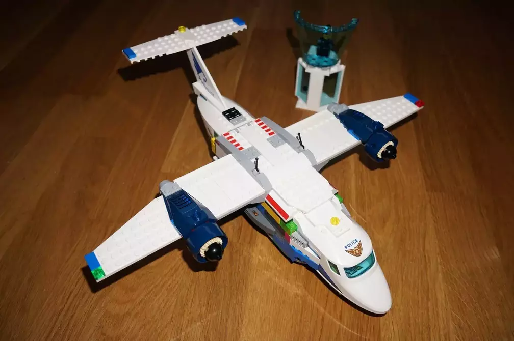
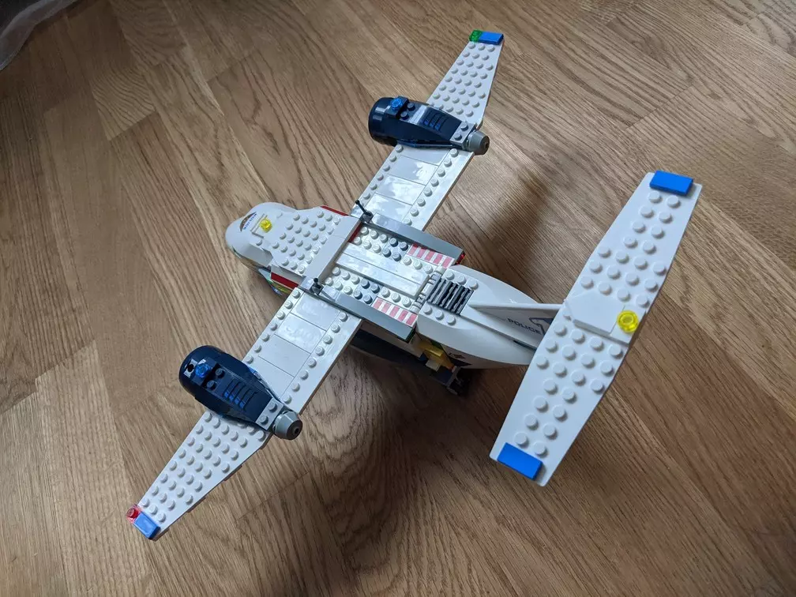
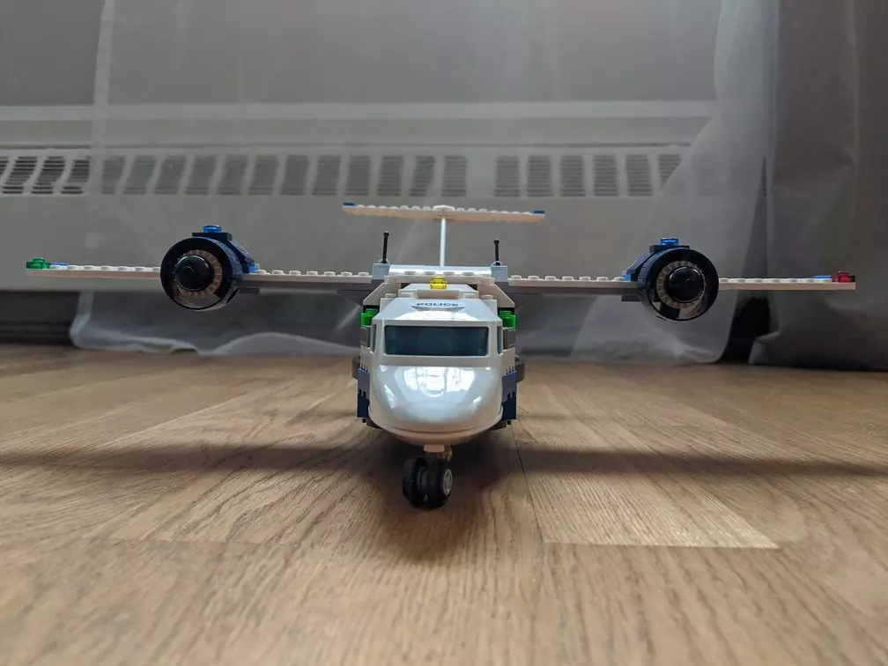
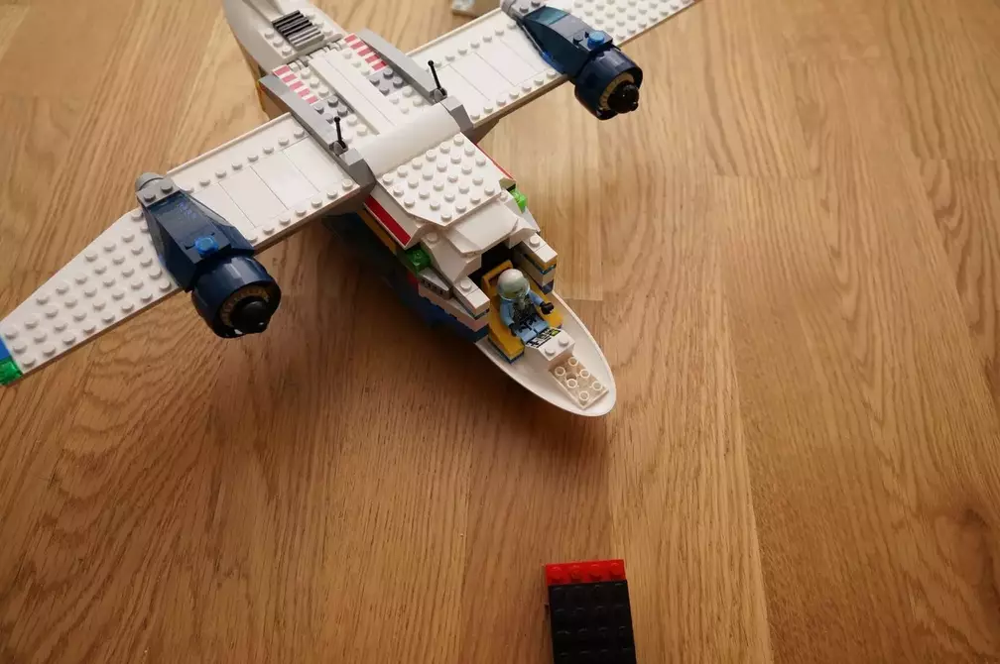
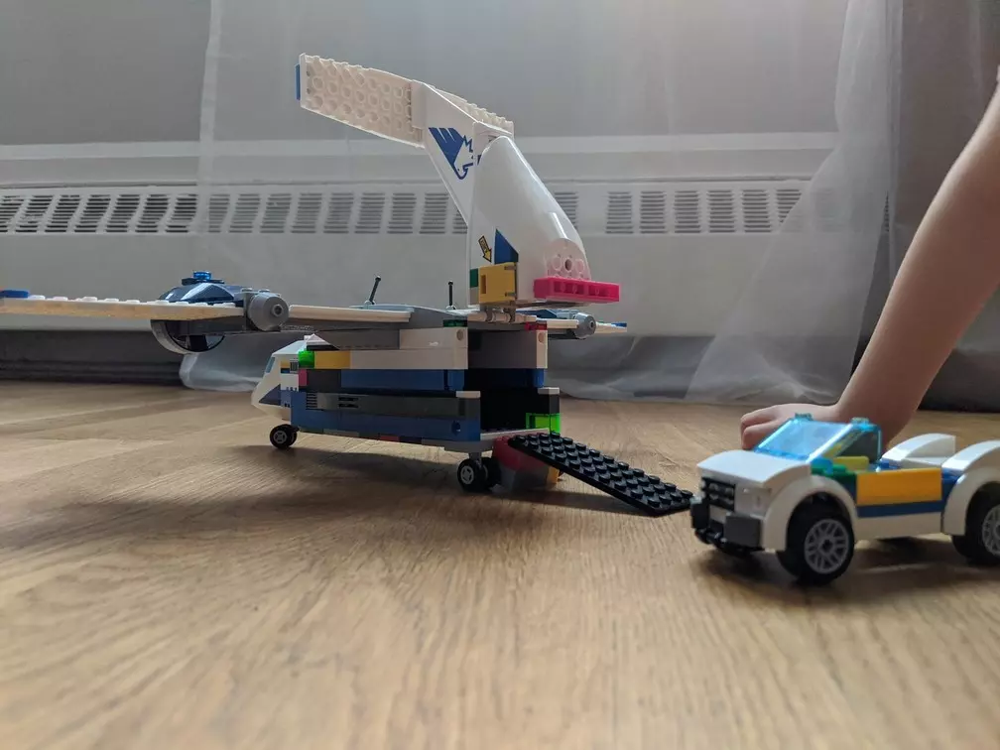

# Lego 60210 change plane to carry car

## Build

<video height="360" controls>
  <source src="Lego_plane_transport_car_build.mp4" type="video/mp4">
</video>

<video height="360" controls>
  <source src="Lego_plane_transport_car_load.mp4" type="video/mp4">
</video>
